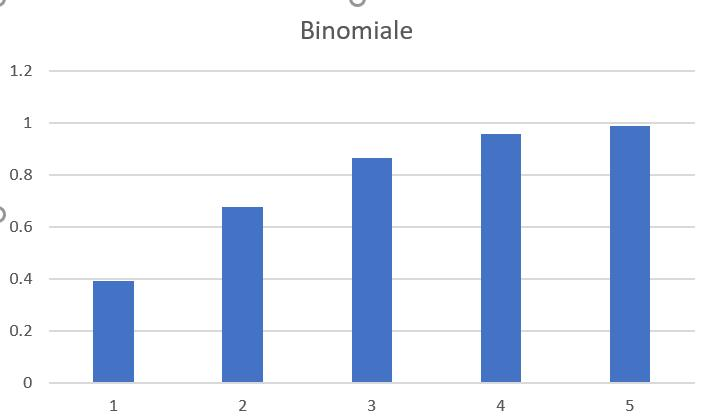

# Documentation

Auteur : Jianying Liu, Qi Wang.

**Cette documentation présente le projet dans le cadre du cours « Langage de script » en M2 TAL parcours Ingénierie Multilingue à l’Inalco.**

**La classification de textes est une des tâches fondamentales dans le traitement automatique des langues. Elle est basée sur les documents proposés en tant que l'entraînement, dans le but de pouvoir classifier de nouveaux documents avec des étiquettes(labels) pré-définis. La classifictaion de textes peut s'appliquer aux pratiques, tels que la détection de spams, l'analyse de sentiments, la classification automatiques d'actualités, etc.**

**Dans ce projet, nous nous penchons sur la classification de tweets français avec le sentiment.**

## Données

Les données ont été choisi sur [Kaggle](https://www.kaggle.com/), où les jeux de données(datasets) disponibles sont en open source. Ils présentent 1,5 millions de tweets en français et leur sentiment(étiquette) en binaire (0 pour négatif, 1 pour positif) sous format csv. Voici le lien pour y accéder et télécharger :  [french-twitter-sentiment-analysis](https://www.kaggle.com/hbaflast/french-twitter-sentiment-analysis).

## Objectifs

L'objectif de notre projet consiste à réaliser une chaîne de traitement de classification de textes à l'aide de [scikit-learn](https://scikit-learn.org/stable/index.html). Afin de créer un classifieur de documents, nous allons implémenter plusieurs méthodes pour l'extraction des features de données textuels et plusieurs algotithmes pour la classification. 


## Méthodologie

La classification de textes basant sur Scikit-learn peut être divisée par les étapes suivantes : 

<! -- TOC -- >
- [1. Pré-traitement de données textuels](#1-Pré-traitement-de-données-textuels)
- [2. Génération de données d'entraînement et de tests](#2-Génération-de données-d'entraînement-et-de-tests)
- [3. Extraction des features de textes](#3-Extraction-des-features-de-textes)
- [4. Construction et évaluation des classifieurs](#4-Construction-et-évaluation-des-classifieurs)
<! -- /TOC -- >

### 1. Pré-traitement de données textuels ###
Les données sont stockés dans un fichier csv, chaque ligne commence par la polarité de sentiment (0 pour le sentiment négatif, 1 pour le sentiment positif), se suit par le contenu de tweet. Voici quelques lignes d'exemple pour mieux visualiser de la structure:

```
0,"Noooooooooooooooooooooooooooooooooooooo! Rafa est hors de wimbledon, je suis tellement éviscéré."
0,Les chatons vont bientôt. Des moments tristes. Je les aime trop
0,Mais je ne peux pas regarder le clip vidéo.
1,Shopping demain oxo
1,"Je ne sais pas si vous le savez, mais ... j'aime lire étrange, hein?"
1,"Aller à toi aujourd'hui si mes parents vont partir. D'abord, ils disent en partant à 11, puis 12 ... bien maintenant, il est 12 ans, et nous sommes encore là!"
```

Ensuite, nous avons effectué des tâches suivantes après l'observation de données:
- Suppression de lignes doublons avec `drop_duplicate()` sur `pandas`.
- Nettoyage de données :

  a. supprimer les urls et des symboles spéciaux (♬,♪,♩,♫, etc.)

  b. remplacer les symboles d'HTML par leurs symboles généraux (`&amp;` => `&`)

  c. remplacer es emoticons par le mot correspondant (`;)` => `smile`, `:o` => `surprise`, etc.)

  d. remplacer les émoticons semi-textuels (`:des rires:` => des rire, `::soupir::` => soupir, etc.)

  e. faire la tokenisation

  f. mettre tous les mots en minuscule (optionnel)

  g. filtrer des stopwords (optionnel)

### 2. Génération de données d'entraînement et de tests ###

Après le nettoyage de données, nous avons séparé et exporté des données en mettant 80% pour le train, et 20% pour le test.
La structure des répertoires se trouve ci-dessous : 

```
resources
├─train
│  ├─negatif
│  │     ├─ 1.txt
│  │     ├─ 2.txt
│  │     ├─ ...
│  │     └─ ...
│  ├─positif
│  │     ├─ 1.txt
│  │     ├─ 2.txt
│  │     ├─ ...
│  └─    └─ ...
└─test
    ├─negatif
    │     ├─ *.txt
    │     ├─ *.txt
    │     ├─ ...
    │     └─ ...
    ├─positif
    │     ├─ *.txt
    │     ├─ *.txt
    │     ├─ ...
    └─    └─ ...

```
À partir des repertoires de donnés bien séparés et établis, nous avons extrait le contenu et leur étiquette, en produisant l'output pourvant être reconnu par scikit-learn pour l'apprentissage: `X_train`(données de l'entraînement), `y_train`(étiquettes de l'entraînement), `X_test`(données du test), `y_test`(étiquettes du test).

```python
X_train, y_train, X_test, y_test = load_datasets()
```

### 3. Extraction des features de textes ###
Le module [sklearn.feature_extraction](https://scikit-learn.org/stable/modules/classes.html#module-sklearn.feature_extraction) se sert à extraire des features d'imgages et de textes. Nous nous concentrons sur le sous-module `sklearn.feature_extraction.text` qui permet d'établir des vecteurs de features à partir de documents textuels. Deux sous-modules ont été implémenté dans notre projet : 

- `feature_extraction.text.CountVectorizer`: convertir une collection de documents textuels à une matrice de fréquence de tokens. 

- `feature_extraction.text.TfidfVectorizer`: convertir une collection de documents à une matrice de feature TF-IDF.

Nous prenons l'extraction de TF-IDF comme l'exemple :

```python
tfidf_vectorizer = TfidfVectorizer()
X_train_tfidf = tfidf_vectorizer.fit_transform(X_train)
words = tfidf_vectorizer.get_feature_names()
```

### 4. Construction et évaluation des classifieurs ###

**Benchmark : classifieur de Naive Bayes**

Le classifieur Naive Bayes est un bon benchmark parmi de divers classifieurs proposés par `scikit-learn`, dont [`MultinomialNB`](https://scikit-learn.org/stable/modules/naive_bayes.html#multinomial-naive-bayes) s'adapte à la classification de textes.

Il suffit d'appliquer le sous-module d'extraction de features de texte `tfidf_vectorizer` (ou `CountVectorizer`) avec le classifieur dans le pipeline, puis faire entraîner les données de train avec la fonction `fit()`, et faire la prédiction avec la fonction `predict()`. 

`sklearn.metrics.classification_report` permet d'afficher l'évaluation de la classification.

```python
text_clf = Pipeline([('vect',TfidfVectorizer()),('clf',MultinomialNB())])
text_clf.fit(X_train, y_train)
predicted = text_clf.predict(X_test)
print("Naive Bayes : MultinomialNB()")
print(classification_report(predicted, y_test))
```

Au niveau des classifieurs, nous avons choisi `MultinomialNB()`(Naive Bayes), `LogisticRegression()`(Logistic Regression), `SGDClassifier()`(SVM), et `DecisionTreeClassifier()`(Decision Tree).

## Résultats et discussions ##


## Implémentation
### modules implémenté : os, shutil ???

 

## Difficultés rencontrées 
**1. Choix de tokenisation pour le corpus français**

 Nous avons essayé d'utiliser deux librairies pour tokeniser les données français : [spaCy](https://spacy.io/) et [NLTK](https://www.nltk.org/). 
 
 Néanmoins, NLTK ne peut pas proposer une tokenisation correcte, c'est-à-dire qu'il tokenise seulement en fonction des espaces. Par exemple, il ne tokenise pas le mot `c'est` en deux tokens `c'` et `est`. De plus, spaCy nous a pris trop de temps pour la tokenisation. 

 Par conséquent, nous proposons une méthode "stupide" pour effectuer la tokenisation avec de l'espace : nous ajoutons un espace une fois l'apostrophe `'` est apparu, sauf un cas particulier `aujourd'hui` en français.

 ```python
    ligne = re.sub(r"'",r"' ",ligne)
    ligne = re.sub(r"aujourd' hui",r"aujourd'hui",ligne)
 ```

**2. pandas**


## image-test

